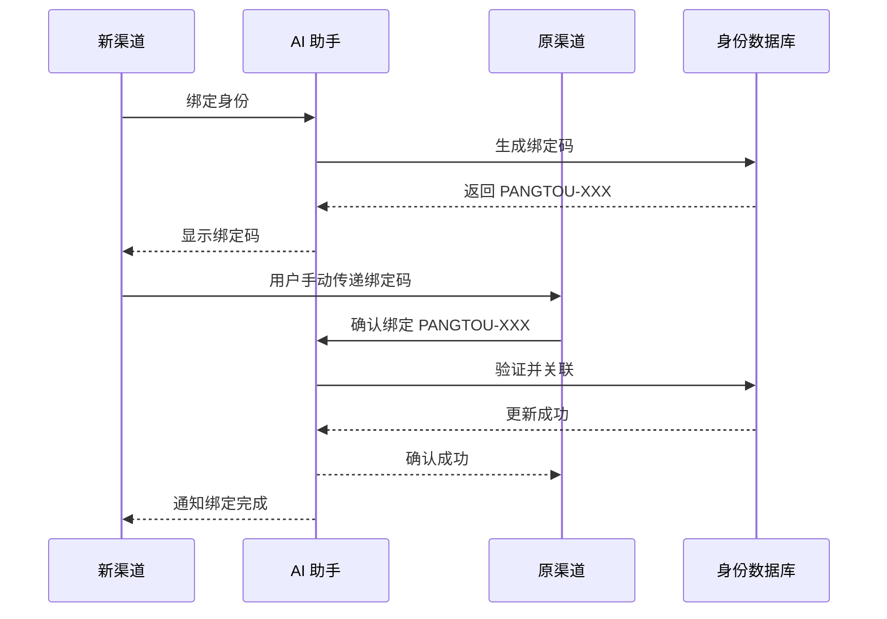

# Channel Identity Link - 跨渠道身份关联

🔑 **让用户在不同聊天渠道之间绑定身份，实现"换渠道不换人"**

[](https://opensource.org/licenses/MIT)
[](https://openclaw.ai)

---

## 🎯 功能特性

- ✅ **跨渠道绑定**：飞书、企业微信、Telegram、WhatsApp 等渠道互相关联
- ✅ **无缝切换**：换渠道后保持身份、记忆、偏好
- ✅ **安全验证**：绑定码 30 分钟有效期，需要原渠道确认
- ✅ **多渠道管理**：支持一个用户绑定多个渠道
- ✅ **隐私保护**：身份数据本地存储，不上传云端

---

## 🚀 快速开始

### 安装

```bash
# 从 ClawHub 安装（推荐）
clawhub install channel-identity-link

# 或手动安装
git clone https://github.com/cicigodd/channel-identity-link.git
cp -r channel-identity-link ~/.openclaw/workspace/skills/
```

### 使用

#### 1️⃣ 新渠道绑定身份

```
绑定身份
```

AI 会生成绑定码：
```
🔑 你的绑定码：PANGTOU-DAD-A7B9

请在飞书（你的主渠道）输入"确认绑定 PANGTOU-DAD-A7B9"完成关联。
⏰ 有效期：30 分钟
```

#### 2️⃣ 原渠道确认

```
确认绑定 PANGTOU-DAD-A7B9
```

#### 3️⃣ 完成

```
✅ 绑定成功！
企业微信已关联到你的身份（爸爸）。
现在你可以在两个渠道无缝切换，我会记住你～
```

---

## 📋 命令列表

| 命令 | 说明 | 示例 |
|------|------|------|
| `绑定身份` | 生成绑定码 | `绑定身份` |
| `确认绑定 <码>` | 确认绑定请求 | `确认绑定 PANGTOU-DAD-A7B9` |
| `我的渠道` | 查看已绑定渠道 | `我的渠道` |
| `解除绑定 <渠道>` | 解除某个渠道 | `解除绑定 企业微信` |
| `我是谁` | 查看当前身份 | `我是谁` |

---

## 🔧 技术架构

### 数据存储

```
~/.openclaw/workspace/identity/
├── linked-channels.json    # 已绑定的渠道
└── binding-codes.json      # 待确认的绑定码（临时）
```

### 绑定流程



---

## 🔐 安全特性

| 特性 | 说明 |
|------|------|
| **绑定码有效期** | 30 分钟，过期自动作废 |
| **双向确认** | 需要原渠道确认，防止恶意绑定 |
| **渠道唯一性** | 一个渠道只能绑定一个用户 |
| **本地存储** | 身份数据存储在本地，不上传 |
| **隐私保护** | linked-channels.json 已加入 .gitignore |

---

## 📁 项目结构

```
channel-identity-link/
├── README.md                     # 本文档
├── SKILL.md                      # OpenClaw Skill 定义
├── _meta.json                    # Skill 元数据
├── scripts/
│   ├── link-identity.py          # 身份绑定主脚本
│   ├── verify-identity.py        # 身份验证
│   └── generate-code.py          # 生成绑定码
├── hooks/
│   └── openclaw/
│       └── HOOK.md               # OpenClaw hook 配置
└── templates/
    ├── bind-request.md           # 绑定请求模板
    └── bind-confirm.md           # 绑定确认模板
```

---

## 🛠️ 开发指南

### 添加新渠道支持

在 `scripts/link-identity.py` 中添加渠道适配器：

```python
CHANNEL_ADAPTERS = {
    "feishu": FeishuAdapter,
    "wecom": WeComAdapter,
    "telegram": TelegramAdapter,
    "whatsapp": WhatsAppAdapter,
    # 添加新渠道
    "discord": DiscordAdapter,
}
```

### 自定义绑定码格式

编辑 `scripts/link-identity.py` 中的 `generate_binding_code` 函数：

```python
def generate_binding_code(user_name="DAD"):
    # 自定义格式
    return f"{user_name.upper()}-{datetime.now().strftime('%Y%m%d')}"
```

---

## 🐛 故障排除

### 问题 1：收不到绑定通知

**原因**：cron 任务未运行

**解决**：
```bash
openclaw cron list
# 如果没有"身份绑定监听"任务，重新安装 skill
```

### 问题 2：绑定后还是不认识我

**原因**：Gateway 未重新加载身份数据

**解决**：
```bash
openclaw gateway restart
```

### 问题 3：绑定码无效

**原因**：绑定码已过期或已使用

**解决**：重新生成绑定码
```
绑定身份
```

---

## 📄 License

MIT License

---

## 👨‍💻 作者

**胖头** 🐱  
Created for 爸爸 - 2026

---

## 🙏 致谢

- [OpenClaw](https://openclaw.ai) - AI 助手框架
- [ClawHub](https://clawhub.com) - Skill 分发平台

---

**Star ⭐ 这个项目如果它帮到了你！**
